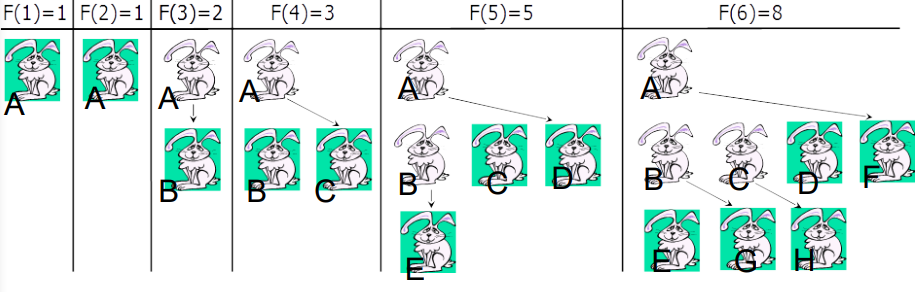
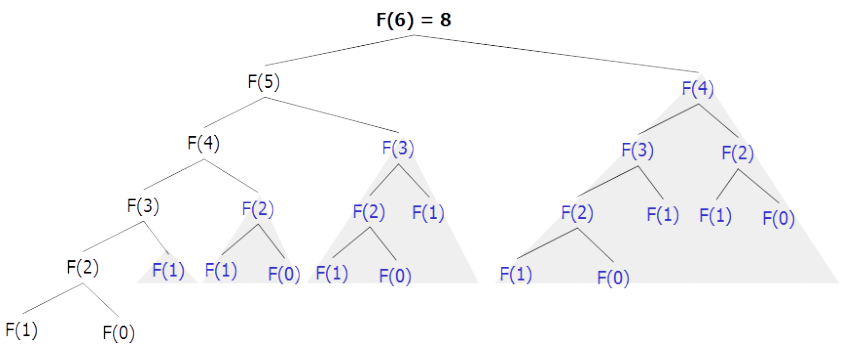
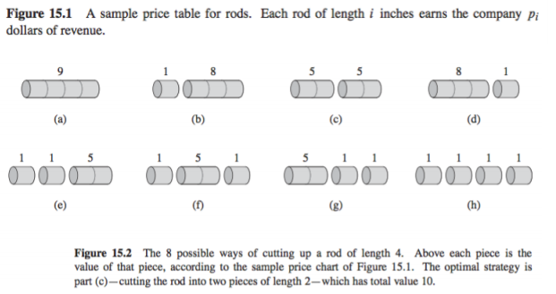
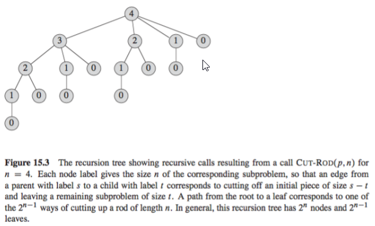

Divide-and-conquer algorithms, explored in the beginning of the course,
solve problems by dividing them into independent subproblems, solving
them recursively, and combining their solutions. In contrast, dynamic
programming, which we will explore in this lecture, is used when the
subproblems are not independent, i.e., they share sub-subproblems.
To avoid recomputing the solutions of such sub-subproblems over
and over again, a dynamic programming algorithm solves every subproblem
just once and saves its solution in a table for a later look-up.
In this way, space is traded for running time.

As we will see, dynamic programming is typically applied in optimization
problems where there is a need to find the best (cheapest, shortest,
largest, smallest, etc.) solution among the many possible solutions.
We will see how dynamic programming works on an example problems of
rod cutting and finding the longest common subsequence of two sequences.

## Why and when to use Dynamic Programming
When sub-problems overlap, a divide-and-conquer algorithm does
more work than necessary, because it needs to repeatedly solve
the overlapped sub-sub-problems.

## How does Dynamic Programming work?
A dynamic programming algorithm solves each sub-sub-problem
only once and then saves its result (in an array or a hash table),
thus avoiding the work of repeatedly solving the common sub-subproblems.

## Fibonacci numbers


```text
FibonacciR(n)
  if n <= 1 then return n
  else return FibonacciR(n-1) + FibonaaciR(n-2)
```

The straightforward recursibe procedure is slow because we keep calculating
the same value over and over again. This means that sub-problems are overlapping -
they share sub-sub-problems as illustrated in the below images.



In the algorithm the sub-problems would be $F(n)=F(n-1)+F(n-2)$.

It is possible to calculate $F(n)$ in linear time by remembering solutions to
the solved sub-problems. We compute the solution in a bottom-up fashion:
`0, 1, 1, 2, 3, 5, 8, 13, 21, 34 ...`. By doing this we __trade space for time__.
This changed the algorithm to:

```text
Fibonacci(n)
  F[0] <- 0
  F[1] <- 1
  for i <- 2 to n do
    F[i] <- F[i-1] + F[i-2]
  return F[n]
```

## Optimization problems
Dynamic programming is typically applied to __optimzation problems__. These
type of problems can have many possible solutions, where each solution has a
value, and we wish to find the most optimal value. An algorithm should
compute the optimal value plus if needed, an optimal solution.

We will look at two concrete examples of optimization problems:
* Rod cutting
* Longest common subsequences

## Rod-cutting
Suppose you have a rod of length $n$, and you want to cut up the rod and sell
the pieces in a way that maximizes the total amount of money you get. A piece
of length $i$ is worth $p_i$ dollars.



For example, if you have a rod of length 4, there are eight different ways to
cut it, and the best strategy is cutting it into two pieces of length 2,
which gives you 10 dollars.

__Exercise__: How many ways are there to cut up a rod of length $n$?

__Answer__: $2^{n-1}$, because there are $n-1$ places where we can choose to make
cuts, and at each place, we either make a cut or we do not make a cut.

Despite the exponentially large possibility space, we can use dynamic programming
to write an algorithm that runs in $\theta (n^2)$.

### Basic approach
First we ask "what is the maximum amount of money we can get?". We can later extend
the algorithm to give us to actual rod decomposition that leads to the maximum value.

Let $r_i$ be the maximum amount of money we can get with a rod of size $i$. We
can then view the problem recursively as follows:

1. Cut a piece off the left end of the rod, and sell it.
2. Find the optimal way to cut the remainder of the rod.

Now we do not know how large a piece we should cut off, which leads us to try all
possible cases. First we try cutting a piece of length 1, and combining it with
the optimal way to cut a rod of length $n-1$. Then we try cutting a piece of length
2, and combining it with the optimal way to cut a rod of length $n-2$.
We try all the possible lengths and then pick the best one. We end up with:

$$r_n = max(p_i+r_{n-1}), 1 \leq i \leq n$$

#### Naive recursive
```text
CUT-ROD(p,n)
  if n == 0
    return 0
  q = -∞
  for i = 1 to n do
    q = max(q, p[i] + CUT-ROD(p,n - i))
```



Note that the computation time is ridiculous, because there are so many subproblems.
If one were to draw the recursion tree, one would see that we are doing much more
work than actually required, because we are computing the same things over and over
again. For example, in the computation for $n = 4$, we compute the optimal solution
for $n = 1$ four times. It is much better to compute it once, and then refer to it
in future recursive calls.

#### Top-down with Memoization
One way to refer to the results in future recursive calls is by writing the
recursion as normal, but store the result of the recursive calls, and if we
need the result in a future recursive call, we can use the precomputed value.
The answer will be stored in $r[n]$

```text
MEMOIZED-CUT-ROD(p,n)
  let r[0..n] be a new array
  for i = 0 to n do
    r[i] = -∞
  return MEMOIZED-CUT-ROD-AUX(p, n, r)
```

```text
MEMOIZED-CUT-ROD-AUX(p, n, r)
  if r[n] >= 0
    return r[n]
  if n == 0
    q = 0
  else q = -∞
    for i = 1 to n do
      q = max(q, p[i] + MEMOIZED-CUT-ROD-AUX(p, n - i, r))
  r[n] = q
  return q
```

__Runtime__: $\theta (n^2)$. Each subproblem is solved exactly once, and to solve
a subproblem of a size $i$, we run through $i$ iterations of the for loop. So the
total number of iterations of the for loop, over all recursive calls, forms
and arithmetic series, which produces $\theta (n^2)$ iterations in total.

#### Bottom-up method
By using this method we proactively compute the solutions for smaller rods first,
knowing that they will later be used to compute the solutions for larger rods.
The answer will once again be stored in $r[n]$.

```text
BOTTOM-UP-COT-ROD(p, n)
  let r[0..n] be a new array
  r[0] = 0
  for j = 1 to n do
    q = -∞
    for i = 1 to j do
      q = max(q, p[i] + r[j-1])
    r[j] = q
  return r[n]
```

Often the bottom up approach is simpler to write, and has less overhead, because
one do not have to keep a recursive call stack. Most people will write the bottom
up procedure when implementing a dynamic programming algorithm.

__Runtime__: $\theta (n^2)$, because of the double for loop.

## Longest common subsequence
Suppose we have a sequence of letters `ACCGGTC`. Then a subsequence of this
sequence would be `ACCG` or `ACTC`, or `CCC`. To get `ACCG`, we pick the first
four letters. To get `ACTC`, we pick letters 1, 2, 6 and 7. To get `CCC`, we
pick the letters 2, 3, and 7, etc.

In the longest-common-subsequence problem, we are given two sequences $X$ and $Y$,
and want to find the longest possible sequence that is a subsequence of both $X$
and $Y$.

One of the measures of similarity is the length of the longest common subsequence
(LCS).
  * Z is a subsequence of $X$, if it is possible to generate $Z$ by skipping some
  (possibly none) characters from $X$
  * $X$ = `ACCGGTC`, $Z$ = `ACTC` is a subsequence of $X$
  * $Y$ = ``

To solve LCS problem we have to find "skips" that generate `LCS(X, Y)` from $X$, and
"skips" that generate `LCS(X, Y)` from $Y$.

## Resources
[CS 161 Lecture 12 - Dynamic Programming](https://web.stanford.edu/class/archive/cs/cs161/cs161.1168/lecture12.pdf)

## Group Exercises

### Exercise 1
> Try to do rod cutting for a rod with length 5. Use the price table
> shown in Figure 15.1, p. 360, CLRS.

### Exercise 2
> Determine a longest common subsequence of `X="GGTTCAT"` and `Y="GTATCT"`
> by running the LCS-Length algorithm (CLRS, page 394). Show how the
> arrays c and b look after the algoritm is performed.

### Exercise 3
> Solve CLRS 15.4-2

### Exercise 4
> Optional: Solve CLRS 15-4 (at the end of chapter 15). Hint: Approach
> the problem in a line-by-line fashion. Think about the possible choices
> when formatting the first line. What kind of subproblems (or a subproblem)
> do you have once you have made a choice of how to format the first line?