## ILO of Lecture 10

After this lecture, you should be able to

- Understand the definition of a graph
- Understand how to represent a graph
- Understand graph searching algorithms
- Understand topologically sorting a directed acyclic graph

## Graph Applications

## Representing a Graph

### Definition:

> A graph $G=(V, E)$, where $V$ is the set of vertices
> and $E$ is the set of edges.

> An edge $e$ connects two vertices. An edge is $e = (v_i, v_j) \in E$, where
> $v_i$, $v_j \in V$.

### Undirected Graph

> $V={A, B, C, D}$

> $E = { (A, B), (B, A), (A, C), (C, A), (C, D), (D, C), (C, B), (B, C) }$

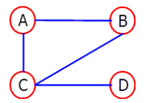

### Directed Graph

> $V={A, B, C, D}$

> $E = { (B, A), (C, A), (C, B), (B, C), (D, C) }$

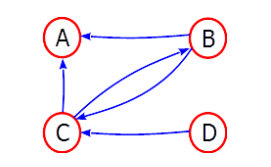

### Notation

There are two ways of representing a graph:

- A collection of adjacency lists
- An adjacency matrix

#### Adjacency Lists

- An array of $|V|$ lists.
- Each list for a vertex $v$ contains:
  - All vertices $u$ such that $(v, u) \in E$

For a undirected graph we get the following:
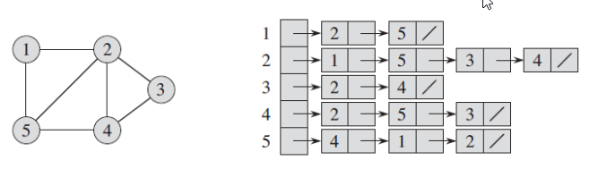

And for a directed graph we get:
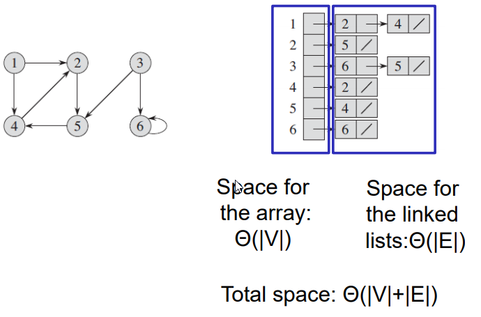

#### Adjacency Matrix

- Matrix $A$
  - Entries for all pairs of vertices.
  - Size: $|V| \times V$.
- $A[i, j] = 1$ vs. $A[i, j] = 0$
  - 1 indicates a connection, and 0 indicates that there are no connecting between
    two vertices.

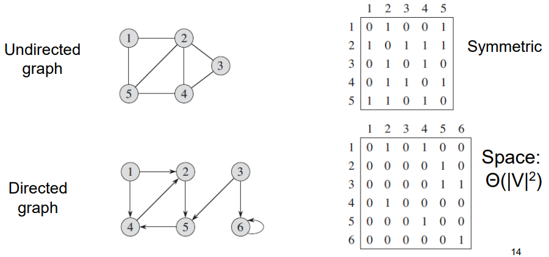

## Searching a Graph

- Systematically follow edges in a graph to visit vertices
- Discover the structure of a graph

We have two search algorithms:

- Breadth First Search
- Depth First Search

### Breadth First Search

Given a graph $G = (V, E)$ and a distinguished source vertex $x$, breadth-first
search systematically explores the edges of $G$ to "discover" every vertex
that is reachable from $s$. It computes the distance (fewest number of edges)
from $s$ to all such reachable vertices. It also produces a "breadth-first-tree"
with root $s$ that contains all such reachable vertices. For any vertex $v$
reachable from $s$, the path in the breadth-first tree from $s$ to $v$
corresponds to a "shortest path" from $s$ to $v$ in $G$, that is, a path
containing the fewest number of edges. The algorithm works on both directed
and undirected graphs.

- **Input**: A graph $G(V, E)$ and a source vertex $s$.

- **Output**: The distance from $s$ to each reachable vertex and a
  breadth first tree rooted at $s$.

- **Aim**: Systematically discovers _every_ vertex that is reachable from $s$.

- **How**: We discover all vertices at distance $k$ from $s$ and then,
  discover vertices at distance $k+1$.

#### Intuition of BFS

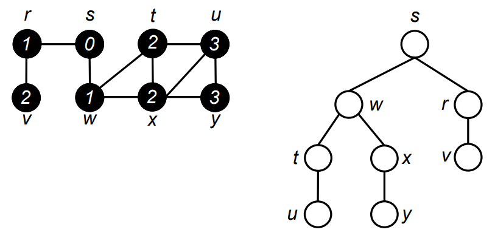

A vertex has a color attribute:

- White: unexplored
- Gray: explored, but not all of its adjacent vertices.
- Black: explored, as well as its adjacent vertices.

To keep track of progress, breadth-first search colors each vertex white, gray
or black. All vertices start out white, and may later become gray and then
black. A vertex is **discovered** the first time it is encountered during the
search, at which time it becomes nonwhite. Gray and black vertices, therefore,
have been discovered, but breadth-first search distinguishes between them to
ensure that the search proceeds in a breadth-first manner. If $(u, v) \in E$
and vertex $u$ is black, then vertex $v$ is either gray or black; that is,
all vertices adjacent to black vertices have been discovered. Gray vertices
may have some adjacent white vertices; they represent the frontier between
discovered and undiscovered vertices.

#### Algorithm

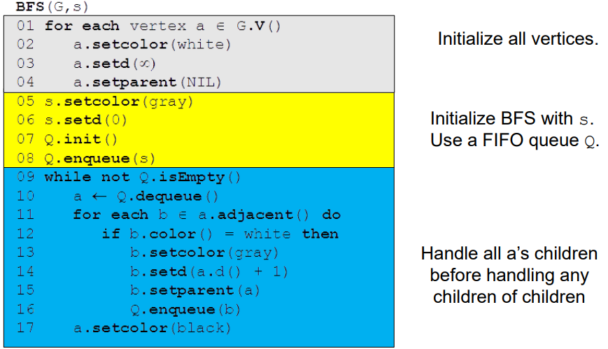

#### Running Example

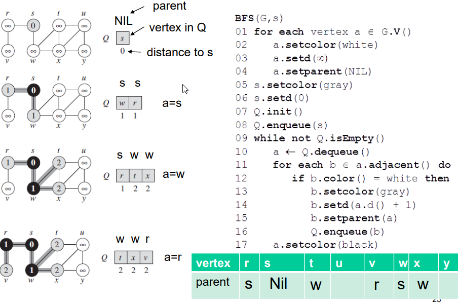

#### Breadth-First Tree

Breadth First Search constructs a breadth-first tree, initially containing only
its root, which is the source vertex $s$. Whenever a white vertex $v$ is
discovered in the course of scanning the adjacency list of an already discovered
vertex $u$, the vertex $v$ and the edge $(u, v)$ are added to the tree. We say
that $u$ is the **predecessor** or **parent** of $v$ in the breadth-first tree.
Since a vertex is discovered at most once, it has at most one parent. Ancestor
and descendant relationships in the breadth-first tree are defined relative to
the root $s$ as usual: if $u$ is on a path in the tree from the root $s$ to
vertex $v$, then $u$ is an ancestor of $v$ and $v$ is a descendant of $u$.

A breadth-first tree:

- Consists of vertices reachable from $s$
- Contains a unique simple path from $s$ to a vertex $v$, which is the
  shortest path from $s$ to $v$.

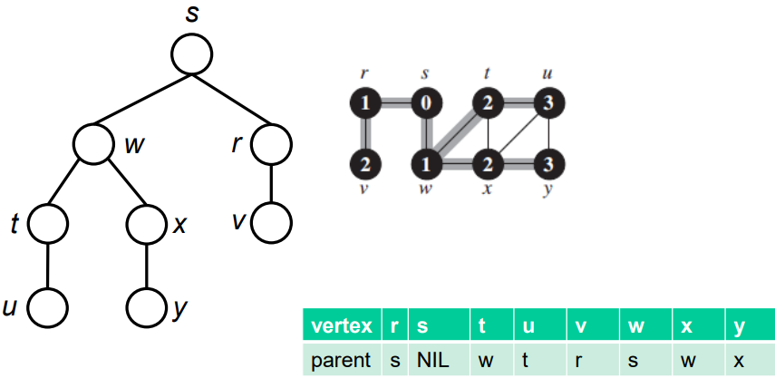

#### Run Time

### Depth First Search

The strategy followed by depth-first search is, as its name implies, to search
"deeper" in the graph whenever possible. In depth-first search, edges are
explored out of the most recently discovered vertex $v$ that still has
unexplored edges leaving it. When all of $v$'s edges have been explored, the
search "backtracks" to explore edges leaving the vertex from which $v$ was
discovered. This process continues until we have discovered all the vertices
that are reachable from the original source vertex. If any undiscovered vertices
remain, then one of them is selected as a new source and the search is repeated
from that source. This entire process is repeated until all vertices are discovered.

As in breadth-first search, whenever a vertex $v$ is discovered during a scan
of the adjacency list of an already discovered vertex $u$, depth-first search
records this event by setting $v$'s predecessor field to $u$. Unlike a
breadth-first search, whose predecessor subgraph forms a tree, the predecessor
subgraph produced by a depth-first search may be composed of several trees,
because the search may be repeated from multiple sources.

- **Input**: A graph $G(V, E)$.

- **Output**: A depth-first forest that is composed of several depth-first trees.

- **Aim**: Systematically visit _every_ vertex in $V$.

- **How**: It search "deeper" in the graph whenever possible.

#### Algorithm

#### Running Example

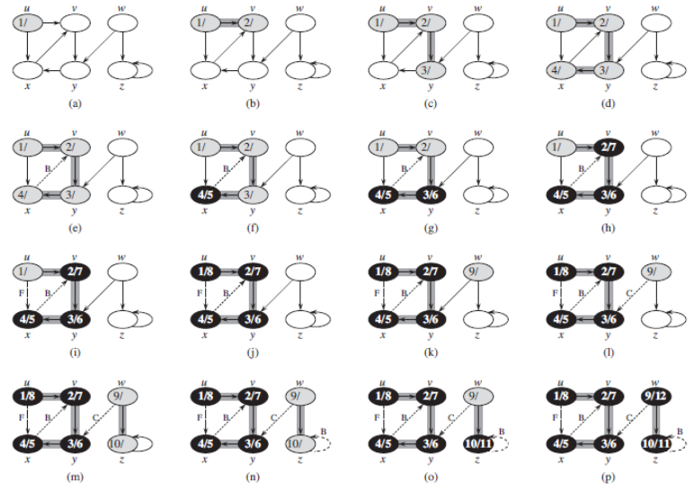

#### Run Time

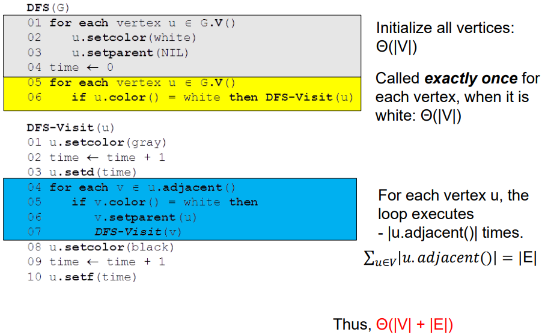

### BFS vs. DFS

Breadth First Search

- Search from one source.
- Only visit the vertices that are reachable from the source.
- Breadth First Tree
- Often serves to find shortest paths and shortest path distances.
- $\mathcal{O}(|V|+|E|)$

Depth First Search

- May search from multiple sources
- Visit every vertex
- Depth First Forest
- Often has a subroutine in another algorithm, e.g.,
  - Classifying edges
  - Topological sort
  - Strongly connected components
- $\theta (|V|+|E|)$

## Classifying Edges

### Edge Classification based on DFS

- Classify edges in a graph into 4 categories based on DFS forest.
- Definition:
  - Tree edges:
    - Edges that are in the DFS forest
    - $(u, v), (v, y), (y, x), (w, z)$
  - Non tree edges
    - Back edges
      - From descendant to ancestor in a DFS tree
        - $(x, v)$
      - Self loops
        - $(z, z)$
    - Forward edges
      - From ancestor to descendant in a DFS tree
        - $(u, x)$
    - Cross edges
      - Remaining edges, between trees or subtrees
        - $(w, y)$

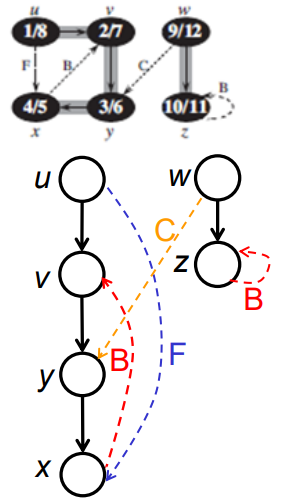

When exploring an edge $(x, y)$, y's color tells something:

- If y is white, edge $(x, y)$ is a tree edge.
- visit x, then y
  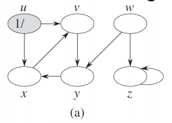

- If y is gray, edge $(x, y)$ is a back edge
- visit y, later x, then y again.
  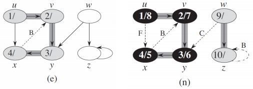

- If y is black, edge $(x, y)$ is a forward or cross edge.
  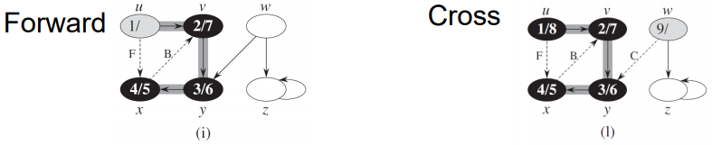

## Topological sort

This section shows how depth-first search can be used to perform topological sorts
of directed acyclic graphs, or "dags" as they are sometimes called. A
**topological sort** of a dag $G = (V, E)$ is a linear ordering of all its
vertices such that if $G$ contains an edge $(u, v)$, then $u$ appears before
$v$ in the ordering. (If the graph is not acyclic, then no linear ordering
is possible.) A topological sort of a graph can be viewed as an ordering of
its vertices along a horizontal line so that all directed edges go from left
to right.

Directed acyclic graphs are used in many applications to indicate precedences
among events. The figure below gives an example that arises when the
professor gets dressed in the morning. The professor must do certain
garments before others (e.g., socks before shoes). Other items may be put
on in any order (e.g., socks and pants). A directed edge $(u, v)$ in the dag placed
at the top in the below figure indicates that garment $u$ must be donned before
garment $v$. A topological sort of this dag therefore gives an order for getting
dressed. The dag placed placed furthest down shows the topolically sorted dag
as an odering of vertices along a horizontal line such that all directed
edges go from left to right.

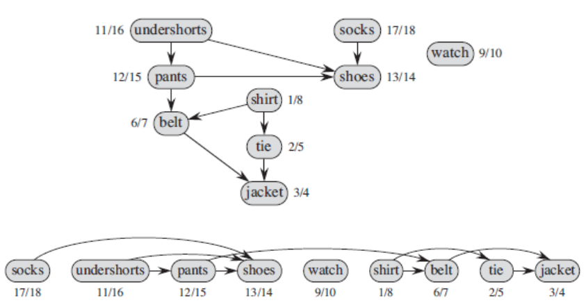

### Algorithm

### How to Check DAG

A directed graph is acyclic if and only if the graph has no back edges.

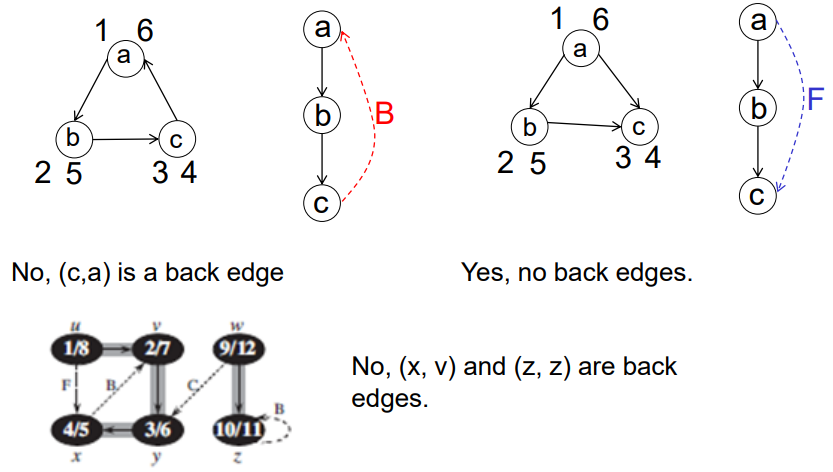

### Topological Sort Example
