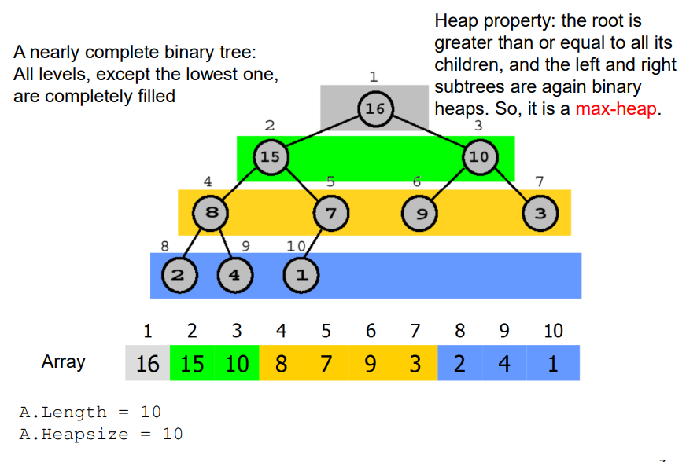
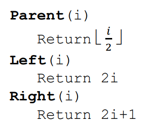
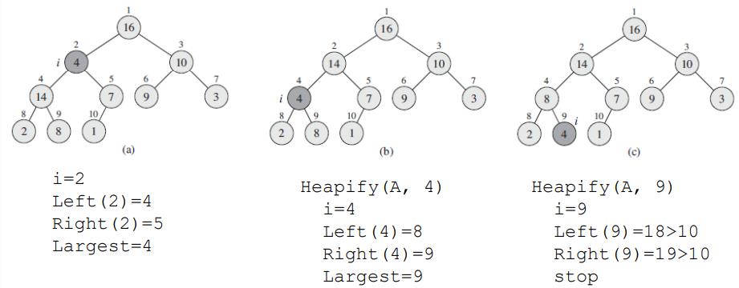
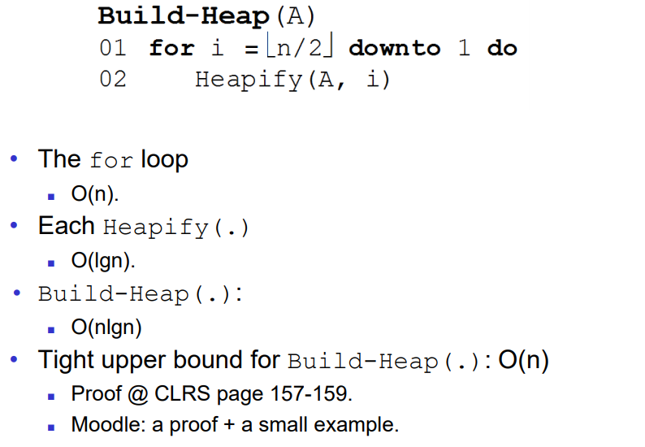
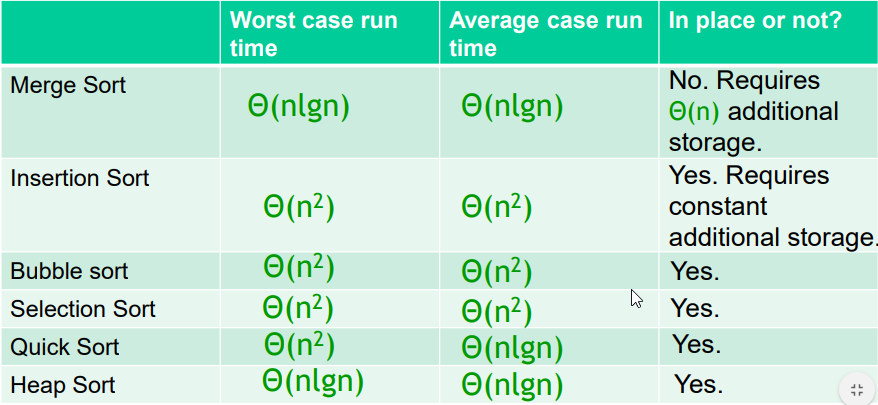

## ILO of Lecture 6
- Understand the "heap" data structure.
- Understand heapsort - using the heap data structure.
- Understand basic data structures, in particular array and stack.

## Heap
The binary heap data structure can be treated as an array $A$, which can
consist of the __heap property__ of __max-heap__ and __min-heap__.

For the heap we have two attributes:
- `A.length`
- `A.heapsize`

### Max-heap
Specifically for max-heap sort we know that the heap property is

$$A[Parent(i)] \geq A[i]$$



To find the value of specific indexes we use these functions:



### Heapify
```text
Heapify(A, i)
  l = LEFT(i)
  r = RIGHT(i)
  largest = index of the largest amoung A[i], A[l], A[r]
  if largest != i then
    exchange A[i]<->A[largest]
    Heapify(A, largest)
```

#### Example: Heapify(A, 2)


If the above mentioned example is not self explanatory, do refer to the
below video for clarification.

`youtube: https://www.youtube.com/watch?v=5iBUTMWGtIQ`

#### Analysis of heapify
In order to properly analyze the heapify we need to identify the recurrence.
- Divide (lines 1-3; refer to the algorithm)
  - Find the largest: $\theta (1)
- Conquer (lines 4-6)
  - Case 1: `largest == i`
    - 0 sub-problem
  - Case 2: `largest != i`
    - 1 sub-problem: at most $\dfrac{2n}{3}$ of the original problem
- Combine: no need

### Building a Heap
- Input: an array `A[1, ..., n]`
- Output: a heap consisting of an array `A` where elements are rearranged
- Subarray $A[\lfloor \dfrac{n}{2} \rfloor + 1, ..., n]$
  - The binary tree leaves
- Assumption of `Heapify( . )`
  - Tree rooted at `Left(i)` = heap
  - Tree rooted at `Right(i)` = heap
- Intuition: Call `Heapify( . )`
  - From $A[\lfloor \dfrac{n}{2} \rfloor]$ down to $A[1]$

### Analysis of building a heap



## Heapsort

The below video goes through the correct flow for a Heapsort:

`youtube: https://www.youtube.com/watch?v=yAlOKmgq8do`

Heapsort is regarded as a selection sort, but incorporates help in the form
of a heap data structure.

```text
Heapsort(A)
  Build-Heap(A)
  for i = n downto 2 do
    exchange A[1]<->A[i]
    A.heapsize = A.heapsize-1
    Heapify(A, 1)
```

### Analysis
- Line 1: $\mathcal{O} (n)$
- Line 2-5: $\mathcal{O} (nlgn)
  - (n-1) iterations
  - Each iteration: \mathcal{O} (lgn) (i.e., `Heapify( . )`)
- Total: $\mathcal{O}(n) + \mathcal{O}(nlgn) = \mathcal{O}(nlgn)$

### Table for reference


## Stack
Intuitively we refer to a stack as a pily of things. The stack consists of `push`
and `pop` operations, which adds/inserts and remove from the top respectively.

A stack `S` is a container of elements, which contains a sequence of elements
$< a_1, a_2, ..., a_i >$ where the top of the stack is $a_i$.

### Operators
All of the below mentioned operations take constant time.

- `Push(S,x)` inserts an element x into the stack S
- `Pop(S)` deletes the element on top of the stakc S
- `Stack-Empty(S)` returns whether the stack is empty

### Properties: LIFO (last in first out)
- Insert only to the top
- Remove only from the top
- Remove follows the reverse order of insert


## Exercises

### Exercise BuildMaxHeap
> Run the heapsort algorithm on the following array of numbers:
> (5, 13, 2, 25, 7, 17, 20, 8, 4). Give the state of the array (a)
> after the _BuildMaxHeap_ operation, and (b) after three
> iterations of the loop.

After the `BuildMaxHeap` operation the state of the array is:
`[25, 20, 13, 17, 8, 7, 4, 2, 5]`

After three iterations of the loop we have:
`[13, 8, 5, 2, 7, 4, 2, 20, 25]`

### Exercise 6.1-1
> What are the minimum and maximum number of elements in a heap
> of height _h_?

For minimum it is $2^{h-1}$

For maximum it is $2^h-1$

__SOLUTION FROM CLRS__

At least $2^h$ and at most $2^{h+1}-1$. Can be seen because a complete binary
tree of depth $h-1$ has $\sum_{i=0}^{h-1} 2^i = 2^h-1$ elements, and the number
of elements in a heap of depth $h$ is between the number for a complete
binary tree of depth $h-1$ exclusive and the number in a complete binary
tree of depth $h$ inclusive.

### Exercise 6.1-4

> Where in a max-heap might the smallest element reside, assuming that all
> elements are distinct?

In any of the leaves, that is, elements with index $\lfloor n/2 \rfloor + 1$,
that is, in the second half of the heap array.