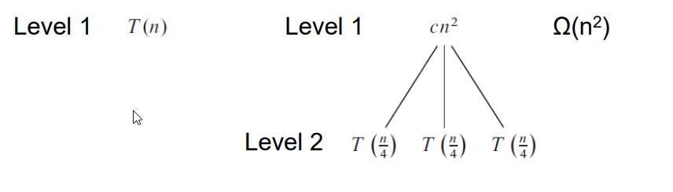
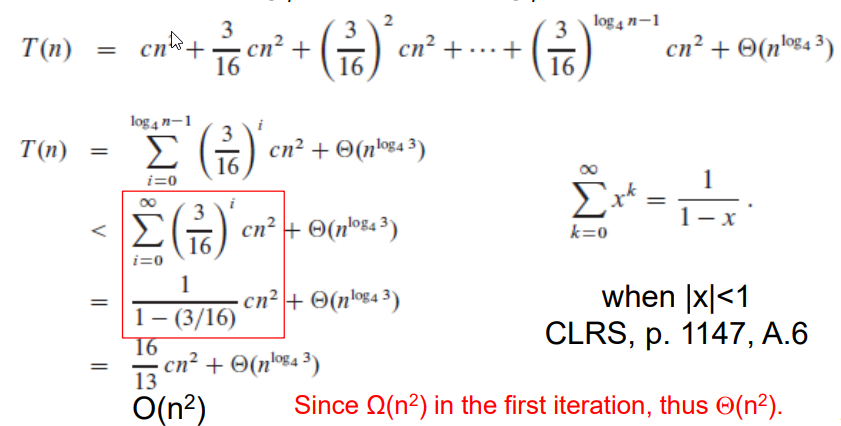
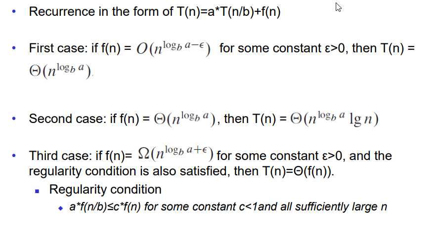

## ILO of Lecture 4

After this lecture, you should be able to:

- Analyze divide-and-conquer algorithms
  - By solving recurrences using _recursion trees_ and the _master method_
- Correctness of algorithms
  - Loop invariants

## Solving recurrences

There are three possible ways of solving recurrences. We have already covered
the repeated substitution method, but these are the three methods:

1. Repeated substitution method

- Expanding the recurrence by substitution and noticing a pattern.
- Identifying an appropriate _i_ such that the base can be plugged in.

2. Recursion-trees

- Draw a tree to visualize what happens when a recurrence is iterated.

3. Master method

- Templates for different classes of recurrences.

### Recursion trees

> A convenient way to visualize what happens when a recurrence is iterated.

- Each **node** represents the cost of a single sub-problem.
- Sum the costs within each level of the tree to obtain a set of **per-level costs**.
- Sum all the per-level costs to determine the **total cost** of all levels
  of the recursion.

#### Example

Solve $T(n)=3*T(\dfrac{n}{4}) + \theta (n^2) = 3*T(\dfrac{n}{4}) + c*n^2$



In order to reach level two you have to run the recurrence once more.
This implies that the term $\dfrac{n}{4}$ turns into $\dfrac{n}{4^2} = \dfrac{n}{16}$.
If we were to reach one level further down the recursion tree, then we run one
more recurrence, which is $\dfrac{n}{4^3}$. If one uses this method multiple times,
one would end up with the following tree:


If we sum all the per-level costs to determine the total cost of all levels
of the recursion we get:

$T(n) =$ level 1 cost + level 2 cost + level 3 cost + ... + level $log_4n$ cost + level $log_4n+1$ cost.



#### Key steps of using recursion trees

- $T(n) = aT(n/b) + D(n) + C(n)$.
  - Let $f(n)=D(n)+C(n)$, then we have $T(n) = aT(n/b) + f(n)$.
- There is $log_bn+1$ levels in a tree.
- There is $a^{k-1}$ nodes in _k_-th level where _k_ is from 1 to $log_bn+1$.
- The cost for the _k_-th level is the number of nodes at _k_-th level \* the cost
  the nodes at the _k_-th level.
- Sum the per level costs into the final cost.

### The master method

A template for solving recurrences **of the form**

- $T(n) = aT(n/b)+f(n)$
- where a $\geq$ 1 and b > 1$ are constant and $f(n)\$ is asymptotically positive.

$T(n)$ is the runtime for an algorithm and we know that

- a subproblems of size $n/b$ are solved recursively, each in time $T(n/b)$
- $f(n)$is the cost of dividing the problem and combining the results
  - \$f(n) = D(n) + C(n)

For merge-sort, we have

- $a=2$, $b=2$: each time we split a problem into $a=2$ subproblems and
  each subproblem is with the half size $(b=2)$ of the original problem.
- Dividing: \theta (1)
- Combining: Merge() function is \theta (n)
- $f(n)=\theta (n)$
- \$T(n) = 2T(n/2) + \theta (n)

#### Master Theorem

`youtube: https://www.youtube.com/watch?v=6CX7s7JnXs0&t=753s`



#### How to

1. Extract _a, b_, and $f(n)$ from a given recurrence.
2. Determine $n^{log_ba}$
3. Compare $f(n)$ and $n^{log_ba}$ asymptotically

- $f(n)$ increases **polynomially** slower, case 1
- They increases similarly, case 2
- $f(n)$ increases polynomially faster, case 3

4. Determine appropriate MM case, and apply

Example of merge sort:

- $T(n) = 2T(n/2) + \theta (n)$
- $a=2$, $b=2$, $f(n) = \theta (n)$
- $n^{log_ba} = n^1 = n = \theta (n)$
- And also, $f(n) = \theta (n)$
- Thus, case 2, $T(n) = \theta (nlgn)$

#### Analyzing D&C Algorithms

If the recurrence is in the form of $T(n)=aT(n/b)+f(n)$ one should try the
master method. If it is not possible to apply the master method, go for
repeated substitution method or a recursion tree.

- Repeated substitution is the preferred method, because it is much easier
  to make mistake when drawing a recursion tree.

## Correctness of algorithms

### Loop invariants

**Invariants** - assertions (i.e, statements about the states of the execution)
that are valid any time they are reached.

We must show three things about loop invariants:

- **Initialization** - it is true prior to the first iteration
- **Maintenance** - if it is true before an iteration, _then_ it remains true
  before the next iteration
- **Termination** - when loop terminates the invariant gives a useful property
  to show the correctness of the algorithm

#### Example of Insertion Sort

** Invariant**: at the start of each for loop, A[1...j-1] consists of
elements originally in A[1...j-1] but in sorted order

```js
for j = 2 to n
  key = A[j] // card in your right hand
  // Insert A[j] into the sorted A[1..j-1].
  i=j-1
  while i>0 and A[i]>key
    A[i+1]=A[i]
    i--
  A[i+1]=key
```

- **Initialization**: j = 2, the invariant trivially holds because A[1] is a
  sorted array.
- **Maintenance**: the inner while loop moves elements A[j-1], A[j-2], ..., A[j-k]
  by one position to the right without changing their order until it finds the
  proper position for A[j]. Then A[j] is inserted into _k_-th position such that
  A[k-1] $\leq$ A[k] $\leq$ A[k+1]. Thus, A[1...j] consists of the elements
  originally in A[1...j] but in sorted order.
- **Termination**: the loop terminates, when $j=n+1$. then the invariant states:
  _"A[1...n] consists of elements originally in A[1...n] but in sorted order"_.

## Exercises

### Exercise 1

> Use the master method to give tight asymptotic bounds for the following
> recurrences:

1. $T(n)=4T(n/2)+n$

- Extract; a = 4, b = 2, f(n) = n
- Determine; $n^{log_b(a)} = n^{log_2(4)} = n^2$
- Compare; $n^{log_b(a)} = n^2$ vs. $f(n) = n$ which is $n^2 > n$
- Thus case 1 because
  - $f(n) = \mathcal{O} (n^{2 - \in})$,
  - $T(n) = \theta (n^{log_b(a)}) = \theta (n^2)$

2. $T(n)=4T(n/2)+n^2$
3. $T(n)=4T(n/2)+n^3$

### CLRS 2-2

> Bubblesort is a popular, but inefficient, sorting algorithm. It works by
> repeatedly swapping adjacent elements that are out of order.
>
> ```js
> BUBBLESORT(A)
>     for i = 1 to A.length - 1
>         for j = A.length downto i + 1
>             if A[j] < A[j - 1]
>                 exchange A[j] with A[j - 1]
> ```

> **a.** Let $A'$ denote the output of `BUBBLESORT}(A)` To prove
> that `BUBBLESORT` is correct, we need to prove that it
> terminates and that
>
> $$A'[1] \le A'[2] \le ... \le A'[n],$$
>
> where $n = A.length$. In order to show that `BUBBLESORT` actually
> sorts, what else do we need to prove?

Answer a:

$A'$ conists of the elements in A

> The next two parts will prove inequality.
>
> **b.** State precisely a loop invariant for the **for** loop in lines 2–4,
> and prove that this loop invariant holds. Your proof should use the structure
> of the loop invariant proof presented in this chapter.

Answer b:

**Loop invariant**: At the start of each iteration of the for loop of lines
2-4, the subarray $A[j..n]$ consists of the elements originally in $A[j..n]$
before entering the loop but possibly in a different order and the
first element $A[j]$ is the smallest among them.

**Initialization**: Initially the subarray contains only the last element $A[n]$,
which is trivially the smallest element of the subarray.

**Maintenance**: In every step we compare $A[j]$ with $A[j-1]$ and make $A[j-1]$
the smallest among them. After the iteration, the length of the subarray
increases by one of the first element is the smallest of the subarray.

**Termination**: The loop terminates when $j=i$. According to the statement of
loop invariant, $A[i]$ is the smallest among $A[i..n]$ and $A[i..n]$ consists
of the elements originally in $A[i..n]$ before entering the loop.

> **c.** Using the termination condition of the loop invariant proved in part
> (b), state a loop invariant for the **for** loop in lines 1–4 that will
> allow you to prove inequality. Your proof should use the
> structure of the loop invariant proof presented in this chapter.
