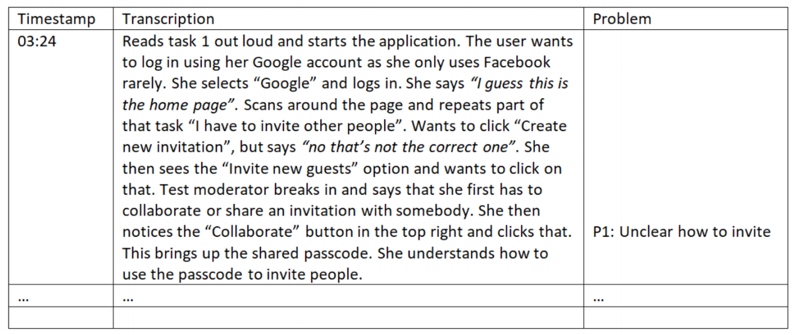

## Activities in Usability Testing

### Determine Basics

- Exploratory
- Assesment
- Validation
- Comparison

### Plan Process

- Purpose
- Key questions
- User profile
- Test method
- Task list
- Context and equipment
- Test monitor role
- Data to be collected
- Report structure

### Create Test Siutation

- Recreation of context
- Selection of test participants
- Design of tasks

### Conduct Test

- Introduction
- Task solving
- Data collection
- Logging
- Debriefing

### Interpret Data

- Transcription of log files
- Data summary
- Data analysis
- Documentation (report)

## What is a usability problem?

For our **user-based** evaluations one would characterise a usability problem as:

> A problem experienced by a specific user while interaction with a specific system

Furthermore, the user:

- is delayed or prevented from completing a task
- feels frustrated
- makes mistakes
- misses important information
- stops talking
- is confused or surprised
- changed strategy or approach
- asks for help
- makes negative comments

For **expert-based** evalutations we have:

> A potential problem identified by a specific expert to be in conflict with a
> specific heuristic or guideline

### Behaviour of Test Moderator

#### Good

Important characteristics of a good test moderator is:

- Solid knowledge about usability
- Fast learner
- Can establish good relations to subjects
- Good memory
- Good at listening
- Good at communicating
- Can handle uncertainty
- Flexible and capable of improvising
- Can stay alert for a long time
- Can maintain an overview

#### Problematic

Typical problems of a problematic test moderator is:

- Controlling rather than supporting
- Too focused on data collection
- Sticks too close to test plan
- Appears better knowing
- Does not establish good relations
- Jumps to conclusions

### Transcription of Log Files

The log file is an important document in the analysis:

- Simplified transcription of the evalutation
- Captures the user interaction in textual form
- Provides overview and "filtered detail"
- Relation between time, events, and usability problems
- Specialized tools exists - but a table in Word will do
- Can be created "live" during tests, and finished from video recordings

## The Problem List

The problem list is the primary outcome from an evaluation:

- A ranked, and numbered list of usability problems
- Indicates how many users experienced the problem (and who)
- Indicated where in the system the problem was experienced
- Describes each identified usability problem in detail and with brief examples
- The problem/description may go across several tasks
- May be divided into two lists: 1) overview and 2) detail

## Categorizing Problems

There is typically three categories involved when categorizing problems:

1. Critical
2. Serious
3. Cosmetic

### Critical problem

- Unable to continue with the given task
- Feels the system behaves strongly irritating
- Critical difference between believed and actual state of the system

### Catastrophic

More than one user experience the same critical problem independently.

## Checklist for Planning Usability Studies

This [list](https://www.nngroup.com/articles/usability-test-checklist/) is provided
by the Nielsen Norman Group, which serves as a guideline for how to properly
conduct usability tests.

Every usability study is different, depending on your specific goals and constraints.
But one thing is common for all user research: even though the basic methods are easy
enough, if you jump into a study without proper preparation, you won’t get nearly as
high a return on your research investment. Below is a checklist of activities to
consider when planning a usability study.

### Define Goals for the Study

Meet with the stakeholders to determine what they want to learn. Identify the questions,
concerns, areas of interest, and purpose for the research.

Usability studies are well suited for gathering qualitative or quantitative **behavioral**
**data** and for answering design-related questions (e.g., is the content presented in a
way that is easy to find and understand? Can people complete a task successfully?).

### Determine the Format and Setting of the Study

Below are some considerations for determining which research approach is appropriate
for your situation:

**In lab or in field**: Should you conduct the study at your facility or go to the participant’s
location? For convenience, most face-to-face usability studies are conducted in-house, in a
lab setting. However, if the users’ actual environment is critical or if it’s difficult to
represent the users’ setup, then the travel time might be worth it.

**Moderated or unmoderated**: Moderated studies tend to provide you with richer design insights
and opportunities to probe and ask for clarification. They also are a better source of open-ended
comments from the participants. On the other hand, unmoderated studies can be cheaper, quicker,
and may provide better access to hard-to-recruit participants.

**In-person or remote**: In general, we recommend in-person studies whenever possible. When you are
in the same room as the participant, the interaction feels more personable and you are able to
detect subtle cues, such as body language, much easier. However, sometimes in-person testing may
not be feasible — for instance, because you have no travel budget, because you work within an
Agile environment, or because users can’t come to you.

### Determine the Number of Users

For traditional qualitative studies, we generally recommend [5 participants](https://www.nngroup.com/articles/why-you-only-need-to-test-with-5-users/) for the best return on investment. If your
research involves more than one target user group, then you may need to adjust the
number of participants to 2–5 per group, depending on the level of experience and attitudinal
overlap between the groups.

Quantitative studies and eyetracking require a larger sample size to obtain meaningful conclusions.
Expect to increase the number of participants by at least 4 times. You may need at least
20–30 participants in each target user group

### Recruit the Right Participants

A foundational rule in conducting user testing is to get representative participants.
The greatest insights are derived from gathering feedback from real users. Identify
people who match your demographics (or even better: match your personas) and then
**screen for behavioral traits, attitudes, and goals** that match those of your users.

### Write Tasks that Match the Goals of the Study

In usability testing, researchers ask users to complete activities while using the interface.
The activities (or tasks) are usually written in the form of scenarios and should match the
goals of the study. The scenarios can range from general to specific, and usually come in
the form of two main types:

Exploratory tasks: These open-ended tasks answer broad, research-oriented goals and may or
may not have a correct answer. These tasks are meant to learn how people discover or explore
information, and they are not appropriate for quantitative testing.

> **Example**: You are interested in booking a vacation for your family. See if the site offers
> anything that might suit your needs.

Specific tasks: These tasks are much more focused and usually have a correct answer or end point.
They are used for both qualitative and quantitative testing.

> **Example**: Find the Saturday opening hours for the Sunnyvale public library.

[Writing solid tasks](https://www.nngroup.com/articles/task-scenarios-usability-testing/) is critical
in conducting a valid study. Strong tasks are concrete and free from clues that might prime people’s
behavior. Vague instructions might cause users to evaluate areas that are not particularly important
for this study. If clues are present, such as when the task contains the same word as on the screen,
the activity is no longer a usability study, but a word-matching game.

### Conduct a Pilot Study

After you have written your tasks, make sure to run a pilot study to help you fine-tune the task wording, anticipate the number of tasks you can give per session, and determine the order in which to present them.
Pilot studies can also help you refine your recruiting criteria, to ensure you are testing with the right participants. Better to catch problems early than during a session when all eyes are on you.

> **Note**: Pilot studies are especially important when conducting online unmoderated studies because you
> are not present to give clarification or make corrections if study participants misinterpret the
> instructions or task descriptions.

> **Summary**: Pilot testing (a session or two before the real test) helps fine-tune usability
> studies, leading to more reliable results. It provides an opportunity to validate the
> wording of the tasks, understand the time necessary for the seeions, and, if all goes
> well, may even supply an additional data point for your study.

### Decide on Collecting Metrics

The main purpose of qualitative usability studies is to gain design insights, and, with few users,
metrics are unlikely to be representative for your whole user population Therefore, measuring usability
is usually not a high priority. In a quantitative study or in a study where you have well defined tasks
and a fairly large number of users, however, this step is important. Common usability metrics are:
time on task, satisfaction ratings, success rate, and error rate.

> **Summary**: Although measuring usability can cost four times as much as conducting qualitative studies,
> metrics are sometimes worth the expense. Among other things, metrics can help managers track design
> progress and support decisions about when to release a product.

#### How to Measure

It is easy to specify usability metrics, but hard to collect them. Typically, usability is measured
relative to users' performance on a given set of test tasks. The most basic measures are based on
the definition of usability as a quality metric:

- Success rate (whether users can perform the task at all)
- The time a task requires
- The error rate, and
- Users' subjective satisfaction

### Write a Test Plan

Once you’ve figured out how you’re going to conduct the research, document your approach in a test
plan and share it. This document serves as a communication tool among team members and a record
for future studies. The document doesn’t need to be lengthy, but should contain key information
such as:

- Name of the product or site being tested
- Study goals
- Logistics: time, dates, location, and format of study
- Participant profiles
- Tasks
- Metrics, questionnaries
- Description of the system (e.g., mobile, desktop etc.)
