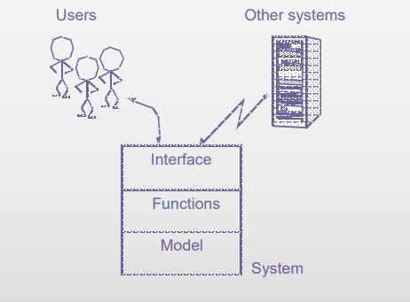
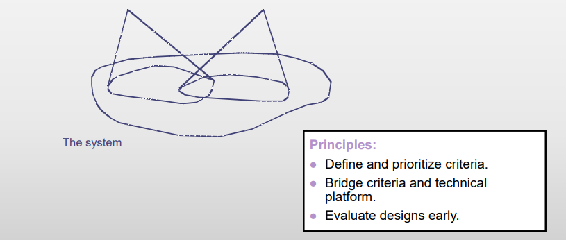
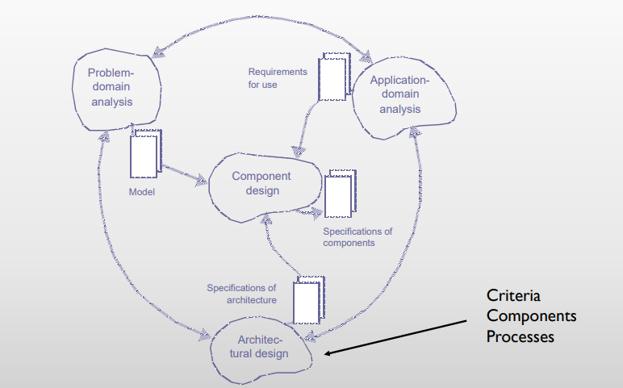
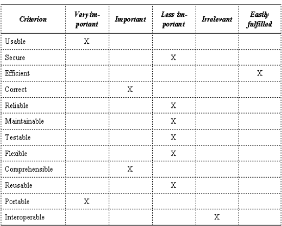
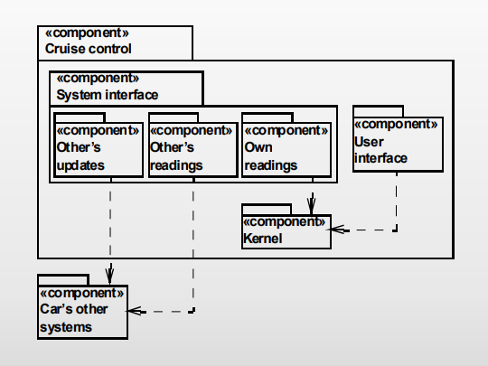
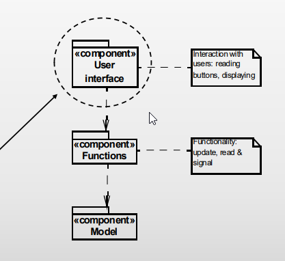
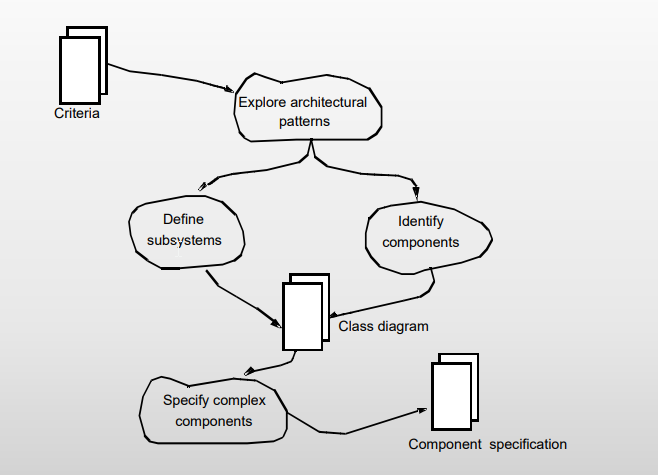
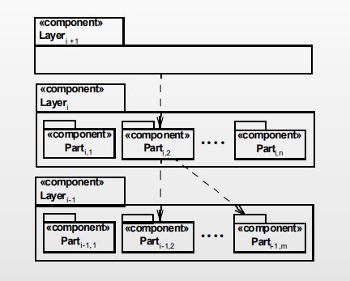
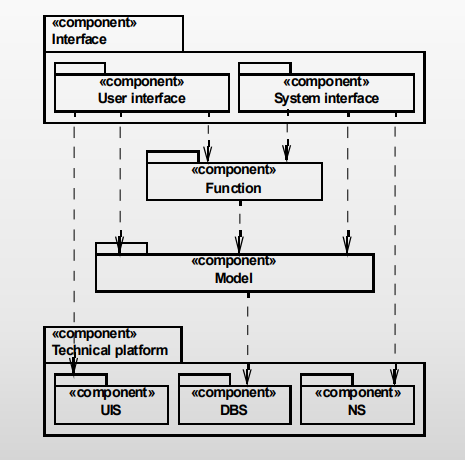

## The end of analysis
This lecture is the transition of moving from _analysis_ towards _design_.

Let us briefly summarize the chapters we have gone through so far:

- System definition used in:
  - Evaluation of candidates for classes and events (chapter 3)
  - Finding actors and use cases (chapter 6)
  - Finding functions (chapter 7)
- Event table used in:
  - Finding candidates for structures (chapter 4)
  - Describring behavioural patterns (chapter 5)
- Class diagram used in:
  - Describing behavioural patterns (chapter 5)
  - Finding interface elements (chapter 8)
- Actors used in:
  - Describing use cases (chapter 6)
- Use cases used in:
  - Finding functions (chapter 7)
  - Finding interface elements (chapter 8)
- Function list used in:
  - Finding interface elements (chapter 8)

## Architectural Design

When referring to the system model, we are referencing the above listed figure.
This is different from the original application/problem domain model, which is
needed when we are talking about interfaces, functions and the model within the
system.

### Key Concepts
_System_: A collection of components that implements modelling requirements, functions,
and interfaces.

_Architecture_: A general structure that is later developed further.

### Two Views

The two views consists of _component_ and _process_ architecture.

#### Component architecture
- classes
- Stable aspects
- Related components
- Logical level
- Structure for descriptions

#### Process architecture
- Objects
- Dynamic aspects
- Coordination of processes
- Physical level
- Strucutre for execution

### Objects in Analysis and Design

It is important to state the clear difference of objects depending of the current
stage of development. In this case analysis and design.

#### Analysis
- Phenomena outside the computer system
- Identity: identifies an object
- State: the quality that characterize an object
- Behaviour: the events an object have performed or suffered

#### Design
- Phenomena inside the computer system
- Identity: gets acces to an object
- State: the values of the object's attributes and object structures
- Behaviour: the operations an object can perform on request and offers to the
other objects (methods)

### Activities

## The Criteria activity

### Result

The end result is a collection of prioritized criterias for the given system.
A collection of criterias could look like something listed below:

It is important to emphasize what is more and less important. Not all
criterias can be prioritized as equally important.

### Key Concepts
For OOA&D we work with the following key concepts when talking about criterias:

Usability
- The system as a whole
- The user's needs
- The technical platform

Flexibility
- Consequences of changes
- Modular design

Comprehensibility
- Overview
- Abstraction
- Use of patterns

### Activities

## The Components activity

### Result

The final result of creating and organizing components is a _structural perspective_,
which _separates concerns in a system_ to _emphasize comprehensibility and flexibility_.

### Key concepts

#### Component

A list of components can be seen as a collection of program parts, which functions
as LEGO blocks to build the system. It constitutes a totality and has a
well-defined responsibility.

Component wise is the smallest possible a __class__ and the largest is a __system__.

As an example on the below image we see a component that has the responsibility
for reading the buttons and updating the display

#### Activites

### Patterns

#### The Layered Architecture

The __layer__ describes a component's responsibility by the oprations it provides
to a layer above and those that are applied from the layer below.

The __part__ is that there is no substantial interaction with other parts in the
same layer.

For __closed architecture__ we only apply operations from an adjacent layer.

For __open architecture__ we apply opeartions from any other layer.

When working with __strict architecture__ one should only apply operations
from a layer below.

In __relaxed architecture__ you should apply operations from the layers both
above and below.

For __strict architecture__ one should apply operations on the layer placed both
above and below the actual layer.

### The Generic Architecture

The __generic architecture__ reflects the actual division of the context into
problem domain and application domain. An example of this would be a single
DanKort terminal.

## Individual Exercises

### Exercise 9.2 (page 188)

### Exercise 9.5 (page 188)

### Exercise 10.3 (page 209)

### Exercise 10.5 (page 209)

## Group Exercises

### Exercise 7 (page 188)
> Consider the design of a specific system with respect to each of the classical
> criteria in figure 9.1 (page 180). How can you practically assess the system's quality
> with respect to each of the criteria? Indicate the expected outcome of such
> an assessment for each of the criteia. Suggest design improvements based
> on this assessment.

| Criterion      | Very important | Important | Less important | Irrelevant | Easily fulfilled |
|----------------|----------------|-----------|----------------|------------|------------------|
| Usable         | X              |           |                |            |                  |
| Secure         |                |           | X              |            |                  |
| Efficient      |                |           | X              |            |                  |
| Correct        |                | X         |                |            |                  |
| Reliable       |                |           | X              |            |                  |
| Maintainable   |                |           |                | X          |                  |
| Testable       |                | X         |                |            |                  |
| Flexible       |                |           |                | X          |                  |
| Comprehensible |                | X         |                |            |                  |
| Reuseable      |                |           |                | X          |                  |
| Portable       |                |           |                | X          |                  |
| Interoperable  |                |           |                | X          |                  |
| Additional     |                |           |                |            | X                |

### Exercise 8 (page 189)
> Analyze the general criteria for design in Figure 9.1. Identify those pairs
> of criteria that can be combined and that conflict or need to be balanced.

The possible pairs of criteria:

- Comprehensible & Usable
- Efficient conflicts with everything else
- Combine Interoperable, Reusable, Portable and Flexible
- Combine Maintainable & Comprehensible

### Exercise 1 on project
> Conduct the activity criteria for your project

### Exercise 2 on project
> Conduct the activity components for you project