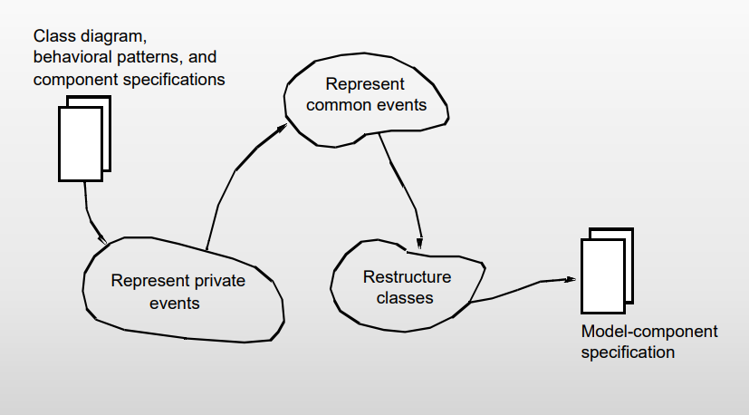
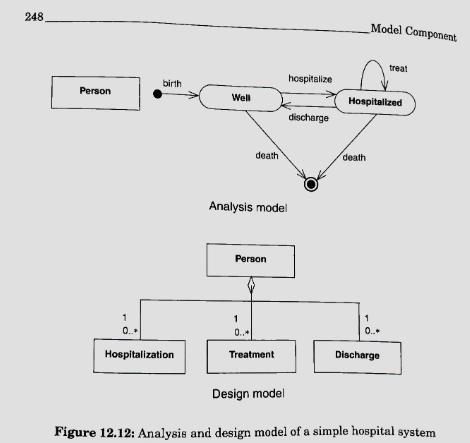
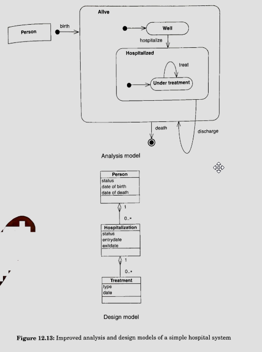

## Component design

### Results

The result of modelling component design is a more specific explanation of details
in individual components, which seeks to describe the system's components.
Furthermore, it also states the connection between components.

### Key concepts

For component design we are transitioning from _Architecture_ to _Components_.
It is important to respect the component architecture and adapt the component
designs according to the technical possibilities.

### Activities

## The Model Component activity

### Results

When defining model components we want to
[trace events](/software/3-semester/su/behavior/#event-traces), which are important
to the program. For instance, if purchasing an item and we decide to edit it,
it would be relevant to trace when the order was changed. It serves as a log within
the system. **NOTE**: if it is not important to trace a specific event, it should
not be included in the analysis as it increases the complexity of the analysis.

### Key concepts

The responsibility of the model component is to maintain an updated representation
of the problem domain and _remember_ what has previously happened in the
problem domain.

### Activities

### Represent Private Events

#### Sequence and selection

- Represent these events as a state attribute in the class described by the
  statechart diagram.
- Every time one of the involved events occurs, the system should assign a new
  value to the state attribute.
- Integrate the attributes of the involved events into the class.

#### Iteration

- Represent these events as a new class; attach it to the class described by the
  statechart diagram using an [aggregation structure](/software/3-semester/su/structure/#aggregation).
- For each iteration that occurs, the system should generate a new object from the
  class.
- Integrate the event attributes into the new class

## Quiz

### Question 1

> What is design?

- Determining the operations an object can carry out and make available to other
  objects in the system.
- Determining how to get access to an object.
- Determination of a phenomenon in the IT-system.

### Question 2

> Which are activities in component design

- Design of the function component
- Design of the connection between components

### Question 3

> When designing the model component for private events:

- For an iteration, create a new class
- For a sequence, create an attribute
- For a selection, create an attribute

### Question 4

> Given the event table and class diagram; which of these statements are correct?
> 

- To represent event 2 a new attribute must be created on class 2.
- To represent even 3 a new class aggregated to class 1 must be created.
- To represent event 4 an attribute must be created on class 5.
- To represent event 5 a new class must either be aggregated to class 5 or 6.

### Question 5

> Given the event table; which of the three solutions is/are correct model components?
> 

- Solution B

## Individual Exercises

### Exercise 12.2 (page 250)

> Why are private and common events represented differently?

### Exercise 12.3 (page 250)

> How are private events represented?

### Exercise 12.4 (page 250)

> How are common events represented?

## Group Exercises

### Exercise 12.6 (page 250)

> Compare and contrast the two alternative design models in figures 12.12 and
> 12.13. Describe their strengths and weaknesses and clarify the argument for
> choosing one over the other.
>  > 

For figure 12.13 it seems more reasonable that treatment is connected
to _Hospitalization_ instead of _Person_ as shown in figure 12.12.
Furthermore, _Discharge_ can not occur unless _Person_ is _Hospitalized_,
which is clearly described in figure 12.13.

### Exercise 12.10 (page 250)

> _Teaching administration_. Continue your considerations of the system for
> monitoring student activities in a university department (see Exercise 3.15).
> Design the model component.

### Identify examples

> Consider the role, relation, hierarchy, and item-descriptor patterns.
> Identify examples of their use in the class diagrams in chapters 19-21.
> Explain how and why.

### Design the model component

> Design the model component for the system in your project.
