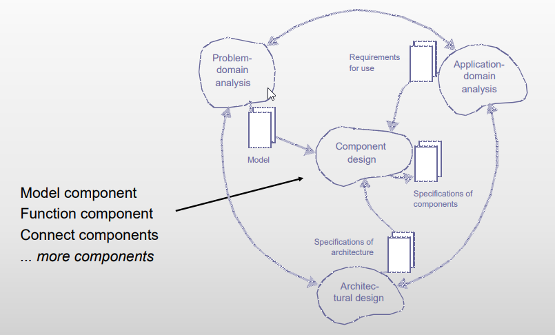
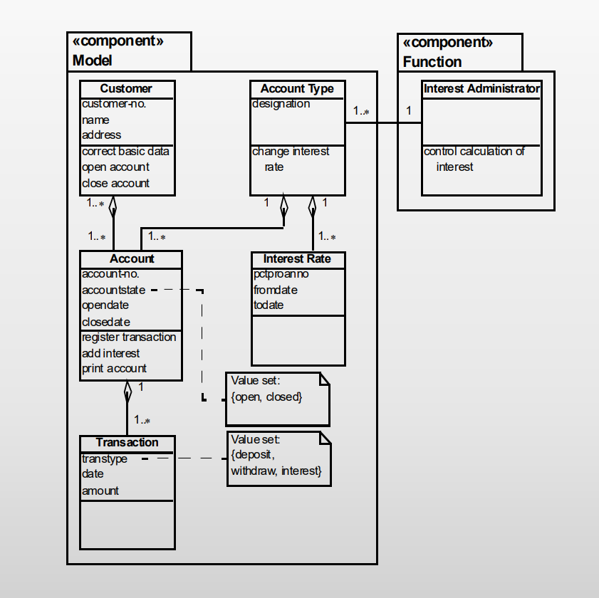
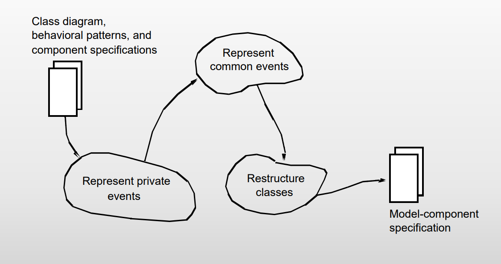
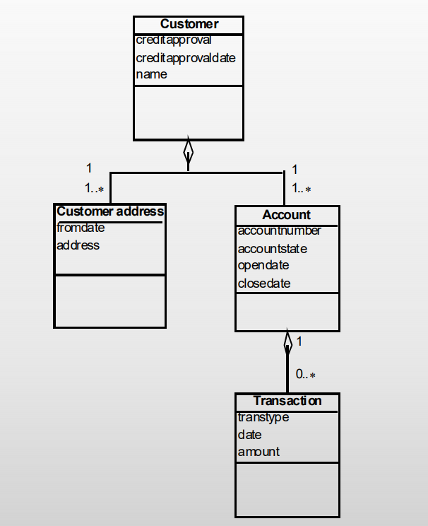
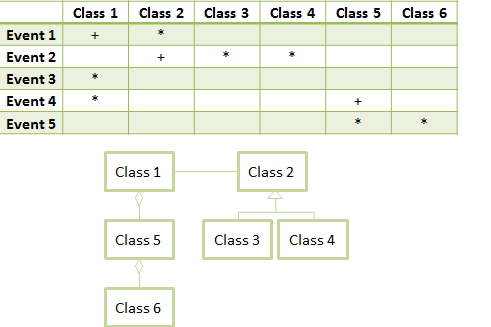
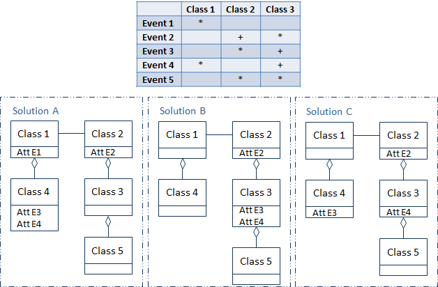

This lecture presents the second overall activity in Object-Oriented Design, more precisely you will get:

1. An overview of the Component Design activity (Part V)
2. A detailed presentation of the Model Component activity (Chapter 12)
3. A discussion of the key concepts in model component design.

## Readings

Chapter 12

## Component Design

### Purpose

To determine an implementation of requirements within an architectural framework.

### Concepts

- Component: A collection of program parts that constitues a whole and has well-defined responsibilities.
- Connection: The implementation of a dependency relation.

### Principles

- Respect the component architecture.
- Adapt component designs to the technical possibilities.

### Results

The result of modelling component design is a more specific explanation of details in individual components, which seeks to describe the system's components. Furthermore, it also states the connection between components.

## Model Component

The purpose of the model component is to deliver current and historical data to functions, interfaces, and ultimately to users and other systems. The stored information is related to the system's problem domain, that is the part of the world that the system is used to administrate, monitor, or control.

The central concept in model-component design is structure. The model should reflect the problem domain's relevant conceptual relations, it should be clear, and it should be both quick and easy to work with. This model describes the problem domain using classes, objects, their mutual structure, and their behavoir.

### Purpose

To represent a model of a problem domain.

### Concepts

- Model component: A part of a system that implements the problem-domain model.
- Attribute: A descriptive property of a class or an event.

### Principles

- Represent events as classes, strucutres, and attributes.
- Choose the simplest representation of events.

### Results

The result of the model-component activity is a revised version of the class diagram from the analysis activity. The revisions typically consists of adding new classes, attributes, and structures to represent events. The below figure illustrates an example of a revised class diagram.

## Designing the Model Component

A problem/domain analysis model expresses the system requirements. You should implement these requirements in a model component, which is defines as:

<Note>
  <strong>Model component:</strong> A part of a system that implements the
  problem-domain model.
</Note>

In analysis, the **model is described as a class diagram** combined with a statechart diagram for each class. However, statechart diagrams require special considerations; one must transform them into something can be represented with the technical platform's mechanisms.

Events are the primitives in the behavioral patterns. If an event that occurs in the problem domain is acceptable to the state and behavioral pattern of the objects involved, one should update the corresponding objects in the system's model component. This can be done through operations on attributes and object structures.
**Operations describe the system dynamics**, whereas **attributes and object structures describe the system's static aspects**. Attributes are defined as:

<Note>
  <strong>Attribute:</strong> A descriptive property of a class or an event.
</Note>

In the following sections, we focus on representing the information that is attached to events: event traces and attribute values for each event.

To represent information attached to certain events, you must **add new attributes to existing classes or add new classes**. This is based on the following principle:

<Note>Represent events as classes, structures, and attributes.</Note>

However, not all information should be stored and it depends on the system's functional requirements. **Information that will never be requested should not be stored**.

## Represent Private Events

<Note>
  Private events are events that involve only one problem-domain object.
</Note>

An example of an event table as illustrated below is useful for identifying private events. To learn about the different notations see the [notation for behavioral patterns](/software/3-semester/su/behavior/#notation-for-behavioral-patterns) section.

 

---

|   Event | Class   Customer |   Account |
| --------------- | ------------------------ | ----------------- |
| Credit approval | +                        | \*                |
| Change address  | \*                       |                   |
| Account opened  | \*                       | +                 |
| Account closed  | \*                       | +                 |
| Deposit         | \*                       | \*                |
| Withdraw        | \*                       | \*                |

An event that **occurs at most once can be remembered as class attributes**. An event that **occurs an arbitrary number of times requires a new class**. The below figure summarizes the general guidelines for representing private events.

|                                                  |                                                                                                                                                                                                                                                                         |
| ------------------------------------------------ | ----------------------------------------------------------------------------------------------------------------------------------------------------------------------------------------------------------------------------------------------------------------------- |
| <strong>Events that only occur in sequence and selection (+)</strong> | <strong>Represent these events as a state attribute in the class describes by the statechart diagram</strong>. Every time one of the involved events occurs, the system shall assign a new value to the state attribute.   Integrate the attributes of the involved events into the class. |
| <strong>Events that occur in iterations (*)</strong>                  | <strong>Represent these events as a new class</strong>; attach them to the class described by the statechart diagram using an aggregation structure. For each iteration, the system shall generate a new objects from the class.   Integrate the event attributes into the new class.      |

## Represent Common Events
If an event is common and thereby affects several objects, one should represent the event in relation to the objects, and possibly add structural connections to give the other objects access to the relevant attributes. The below figure summarizes the guidelines for representing common events.

|              	|                                                                                                                                                                                                                                                                                           	|
|--------------	|-------------------------------------------------------------------------------------------------------------------------------------------------------------------------------------------------------------------------------------------------------------------------------------------	|
| <strong>Common event</strong> 	| If the event is involved in the statechart diagrams in different ways, represent it in relation to the class that offers the  simplest representation.    If the event is involved in the statechart diagrams in the same  way, you must weigh possible representations against each other. 	|

### Choosing Between Alternatives
If a common event is only involved in iterations in all the involved classes' statechart diagrams, one must more closely examine the possible alternatives. The event table in [represent private events](#represent-private-events) illustrates this situation. The events `deposit` and `withdraw` occur only in iterations in both the `Customer` and `Account`. We must add two new classes, and there are two possible ways of implementing these. Option A is to represent these events as new classes under `Account` as illustrated below:

Alternatively, the events `deposit` and `withdraw` can be represented as new classes under `Customer` as illustrated below in option B:

Option B implies a complex structure because we have two associations across, therefore, we select solution A.

## Restructure Classes
Having reached a revised class diagram, listed above, which is capable of representing all information about the events, one can now consider whether it is possible to simplify it. The following section introduces three examples that show how this can be done.

### Generalization
The bottom classes of solution A, which involes `Deposit` and `Withdraw` can be __simplified as these have the same attributes__. The only reason we originally have two classes is that we want to distinguish between their objects. However, classes are not necessary to do this. The right side of below figure shows that we instead can __use one attribute showing the class__ as indicated through the `transtype` attribute in the new class `Transaction`. By implementing this solution we have generalized two events that were identified in the analysis.

### Association
When you add classes and structures, you must reconsider old structures to see if they've become superfluous and can be removed. The below figure shows an example of incorporating association restructuring to enhance the model.

The only important event to make note of is that customers visit gas stations to get gas. Applying the guidelines, we created a new class `Filling` to remember the `fill` event. This class is connected through aggregation to the `Gas station` and `Customer` class. However, we notice that the association between the two aforementioned classes is no longer relevant because __the information is now available thorugh the__ `Filling` __object__, which makes the original association redundant. The new implementation follows the [relation pattern](/software/3-semester/su/structure/#the-relation-pattern) described in [structure](/software/3-semester/su/structure/).

## Quiz

#### Question 1

> What is design?
>
> Select one or more:
>
> * Determination of a phenomenon in the IT-system
> * Determining the operations an object can carry out and make available to other objects in the system
> * Determination of a phenomenon in the context of the IT-system
> * Identification of objects
> * Determining how to get access to an object
> * Determination of the events an object performs or experiences

* Determining how to get access to an object.
* Determination of a phenomenon in the IT-system.
* Determining the operations an object can carry out and make available to other objects in the system.

#### Question 2

> Which are activities in component design
>
> Select one or more:
>
> * Designing the process architecture
> * Design of the model component
> * Design of the function component
> * Designing the component architecture
> * Design of the connection between components
> * Determining the design criteria

* Design of the model component.
* Design of the function component.
* Design of the connection between components.

#### Question 3

> When designing the model component for private events:
>
> Select one or more:
>
> * For a selection, create an attribute
> * For a sequence, create an attribute
> * For an iteration, create a new class
> * For a sequence, create a new class
> * For an iteration, create an attribute
> * For a selection, create a new class

* For a selection, create an attribute
* For a sequence, create an attribute
* For an iteration, create a new class

#### Question 4

> Given the event table and class diagram; which of these statements are correct?
> 
>
> Select one or more:
>
> * To represent event 1 a new class aggregated to class 1 must be created
> * To represent event 2 a new attribute must be created on class 2
> * To represent event 2 a new attribute must be created on class 3 or 4
> * To represent event 3 a new class aggregated to class 1 must be created
> * To represent event 4 a new class aggregated to class 1 must be created
> * To represent event 4 an attribute must be created on class 5
> * To represent event 5 a new class must either be aggregated to class 5 or class 6
> * To represent event 5 two new classes each aggregated to class 5 and 6 must be created

- To represent event 2 a new attribute must be created on class 2.
- To represent event 3 a new class aggregated to class 1 must be created.
- To represent event 4 an attribute must be created on class 5.
- To represent event 5 a new class must either be aggregated to class 5 or 6.

#### Question 5

> Given the event table; which of the three solutions is/are correct model components?
> 
>
> Select one or more:

- Solution B

## Individual Exercises

#### Exercise 2 (page 250)

> Why are private and common events represented differently?

They are represented differently because private events are concerned with one and only one problem-domain object, whereas common events affects several objects.

#### Exercise 3 (page 250)

> How are private events represented?

An event that occurs at most once can be remembered as class attributes (+). An event that occurs an arbitrary number of times requires a new class (*). See [represent private events](#represent-private-events) for more.

#### Exercise 4 (page 250)

> How are common events represented?

If an event is common and thereby affects several objects, one should represent the event in relation to the objects, and possibly add structural connections to give the other objects access to the relevant attributes. See [represent common events](#represent-common-events) for more.