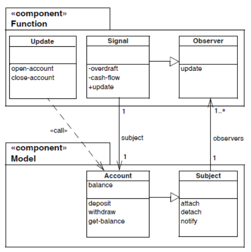
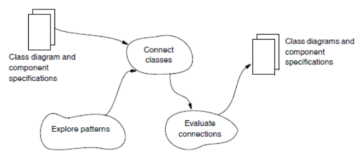
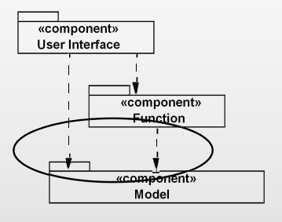
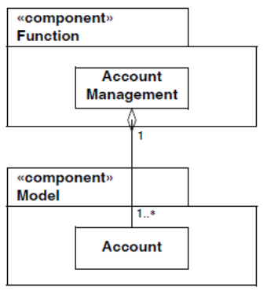
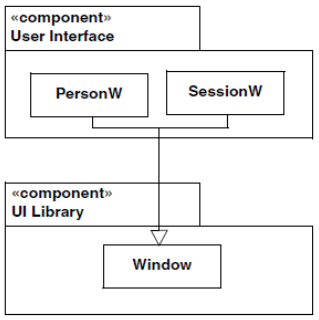
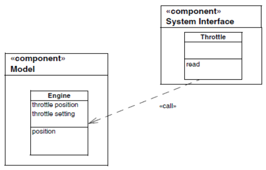
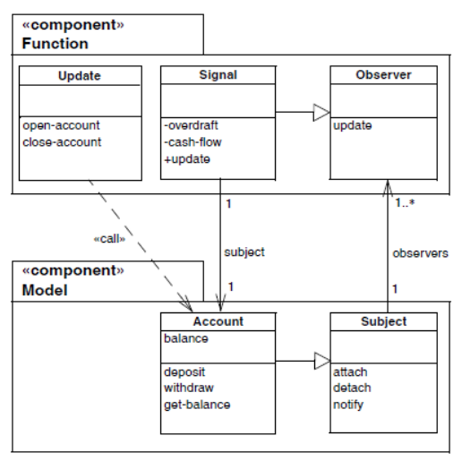
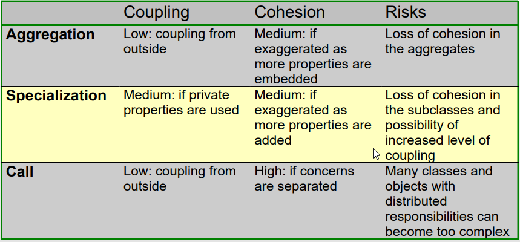
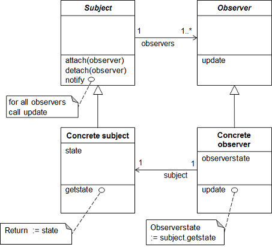

## The Connecting Components activity

### Results

The results of the activity of connecting components is:

- A revised class diagram for components of the system
- An architecture includes dependencies between components
- The implementation of these dependencies must be designed
- The dependencies are designed as connections between the classes
  in the components
- The revised class diagram specifies these connections precisely

### Activities

### Connect Classes

**Component**: A collection of program parts that constitutes a whole and has
well-defined responsibilities.

**Connection**: Realization of a dependency between components.

- Aggregation
- Specialization
- Call

#### Connection: Aggregation

A dependency can be realized by letting a class in one component aggregate
a public class from another component.

#### Connection: Specialization

A dependency can be realized by defining a class in one component as a
specialization of a public class in another component.

#### Connection: Call

A class in one component calls a public operation in another component.

### Explore Patterns

The most general pattern for realizing dependencies between classes is
called _Observer_.

- The _Subject_ knows its observers and provides attaching and detaching observers.
- The Observer provides an update operation to the subject.
- The involved objects are all from either _Concrete Subject_ or _Concrete Observer_.
- The concrete subject notifies its observers when its state has changed.
- The concrete observers each know their concrete subject and each implement
  the update operation.

#### Using the Observer Pattern

- The _Account_ is the concrete object.
- The _Signal_ class contains the oprations to observe the state of an Account object.

### Evalutate Connections

## Quiz 11

### Question 1

> Which structures are used to connect components?

### Question 2

> What do we strive for?

### Question 3

> What is the purpose of this pattern?
>
> 

## Individual Exercises

### Exercise 1 (page 283)

> What is coupling?

### Exercise 2 (page 283)

> What is cohesion?

### Exercise 3 (page 283)

> Why should we design cohesive classes and components with low coupling?

### Exercise 7 (page 283)

> How are connections between components evaluated?

## Group Exercises

### Exercise 9 (page 284)

> Discuss the complete class diagram in the Cruise Control System (Chapter 22)
> and evaluate the coupling and cohesion of this design. Consider how and to
> what extent you might use the observer pattern to improve this design.

### Exercise 12 (page 284)

> _Teaching administration_. Continue your considerations of the system
> for monitoring student activities in a university department (see Exercise 3.15).
> Design the connections between the components and evaluate the resulting
> coupling and cohesion.

### Conenct components activity

> Start on the Connect components activity for your project
