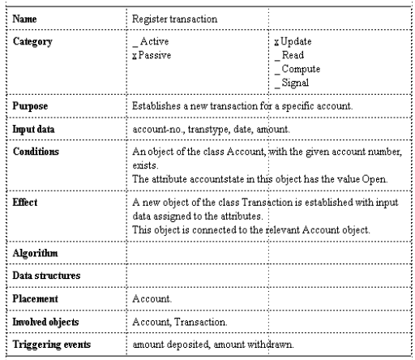
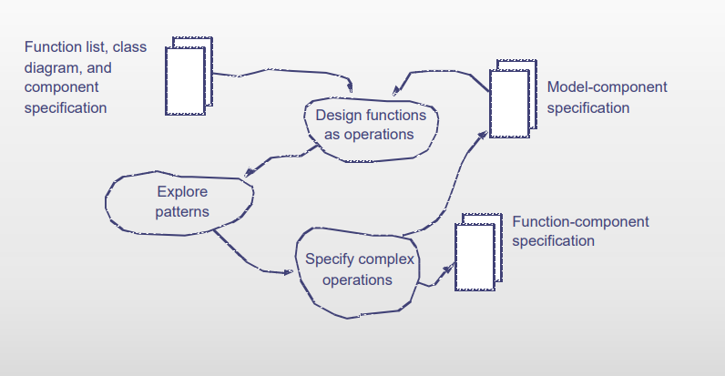
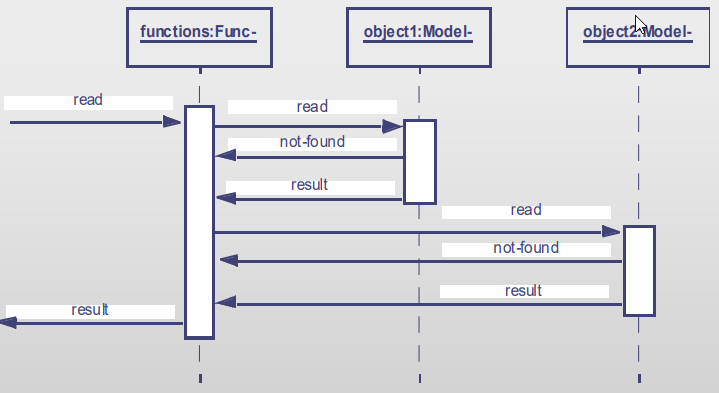
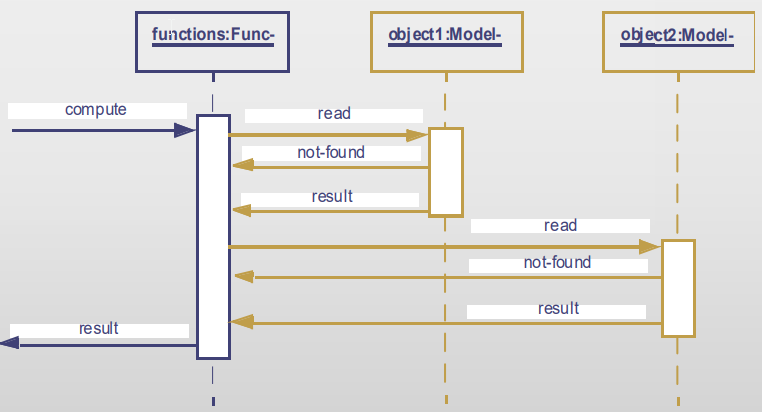
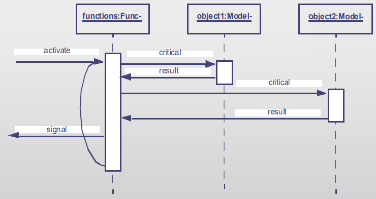
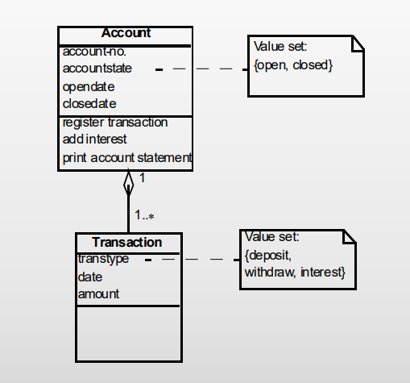
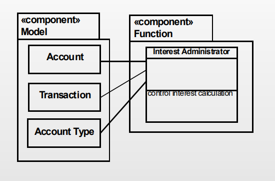
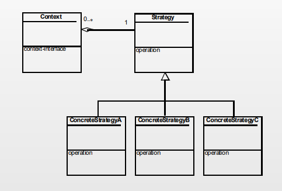

## The Function Component activity

### Results

We have our model from the application domain analysis, which consists
of classes and its possible attributes. From this we implement the function
component, which is a specification from the already generated function list.
To explain this, one should extend with operations realizing requirements to
functions from the analysis of the application domain.

> **Definition**: Operation: A Process property specified in a class and activated
> through the class' object.

### Responsibility

**Component**: A collection of program parts that constitutes a whole and has well-defined
responsibilities.

**Responsibility of the function component**: Make the model component available as a resource to actors.

### Activities

## Design Function as Operations

### Update

Update functions are directly linked to problem domain events. An update function receives input data
that describes the events, and its primary output data is the model update.

### Read

A read function reflects the need os a user or another system to get information from the model.
The system is viewed as a database, in which the desired information can be found as attributes.
A read function receives input data describing the desired reading. Typically, the input data
will be one or more attribute values, which might also be input data describing how the read
should be done.

### Compute

A compute function signifies that a user or another system needs data processing, which may involve
reading of the model. Input data ti a compute function include both the numbers that are part of the
computation and attributes that describe those model objects that are relevant to the computation.
Output data from the function is the results, which is returned to the user or the system that
activated the computation.

### Signal

Signal functions express requirements about monitoring or control. In many cases, a signal function
does not receive special input data. The primary input data comes from the model, and the function
gets its basic data by continuously reading the model. Output data from the function is either
a message to a user in the application domain or a control impulse directly to a device.

## Patterns

The patterns listed in the following section specifies how functions can be realized as a set of operations

### Model-Class Placement

A number of operations are specified on class `Account`. That again is realized through several
operations:

- Transaction registration (update)
- Calculate interests (compute) and deposit interests (update)
- Print account statement (read)

### Function-Class Placement

Some operations cannot be placed on a class in the model. Typically functions that operate
on several objects. A new class is then designed in the function component. That class
contains the operation that realizes the function.

### Strategy

If a class has several specializations and a function is performed differently dependent on each
specialization. The Strategy Pattern defines a general operation that is then described in details in
each specialization.

### Active Function

A signal function can be active or passive. An active function can be realized in an active object.
The function is then realized with its own control.

## Quiz

## Individual Exercises

### Exercise 1 (page 271)

> What is the responsibility of the function component?

### Exercise 4 (page 271)

> What considerations are involved in implementing update functions?

### Exercise 5 (page 271)

> What considerations are involved in implementing read functions?

### Exercise 6 (page 271)

> What considerations are involved in implementing compute functions?

### Exercise 7 (page 271)

> What considerations are involved in implementing signal functions?

### Exercise 8 (page 271)

> When are operations placed on classes in the model component?

### Exercise 9 (page 271)

> When are operations placed on classes in the function component?

## Group Exercises

### Exercise 14 (page 271)

> Consider the analysis of the Hair Salon System (Chapter 20). List the functions that should
> be implemented using the model-class placement and the function-class placement pattern
> respectively.

**NOTE**: For this exercise we will look at the Butlr project instead.

### Exercise 17 (page 271)

> _Teaching Administration_. Continue your considerations of the system for monitoring student
> activities in a university department (see Exercise 3.15). Design the function component
> and make a detailed specification of one of the complex functions.

### Start design of function component

> Start on the design of the function component for your project
